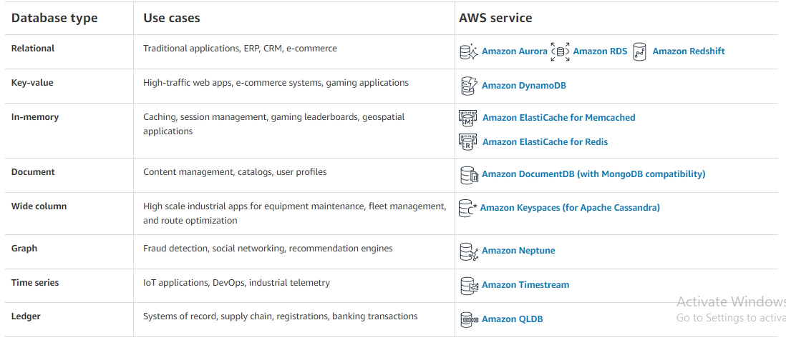

# AWS: Events

# Review, Research, and Discussion

**Describe the similarities between AWS API Gateway + Lambda functions and an ExpressJS Server**

- with express server you can build an API-server & write the functions for each route to respond each of them.
- same fynctionality you can done by Lambda & API-Gateway services. Lambda will represents the function that will respond to one route and API-Gateway will create your own API-server with HTTP protocol and will link each route with its Lambda function.

**List the AWS Database offerings and talk about the pros and cons of each**

 

**What’s the difference between a FIFO and a standard queue?**

**How can the server be assured a message was properly received?**

- by logging tools or tests.

### External resources :

- [https://www.allthingsdistributed.com/2018/06/purpose-built-databases-in-aws.html](https://www.allthingsdistributed.com/2018/06/purpose-built-databases-in-aws.html)
- [https://aws.amazon.com/products/databases/](https://aws.amazon.com/products/databases/)
- [https://medium.com/awesome-cloud/aws-difference-between-sqs-standard-and-fifo-first-in-first-out-queues-28d1ea5e153](https://medium.com/awesome-cloud/aws-difference-between-sqs-standard-and-fifo-first-in-first-out-queues-28d1ea5e153)

# Document the following Vocabulary Terms

**Serverless API** : this API that will can create it without writing any line of codeing, and will run without thinking of maintaining server.

**Triggers** : an action that when happaen will run a function to do something.

**Dynamo vs Mongo** : Dynamo is AWS NoSql database service. Mongo is a service that uses MongoDB service.

- in Dynamo you can use this database with other AWS services but in Mongon only you can use with your own servers and APIs.

- this link contains full comparison betwwen them :

- [https://www.whizlabs.com/blog/dynamodb-vs-mongodb/](https://www.whizlabs.com/blog/dynamodb-vs-mongodb/)

**Dynamoose vs Mongoose** : both of them are npm package that allow you to control of your NoSql database.

- Dynamoose for DynamoDB.
- Mongoose for MongoDB.

# Preparation Materials

# SQS and SNS Basics

- messaging : from message prodeucer to processing the to message consumer.

- queues : queue used to handle messages with FIFO & standard queues.

- pub/subs : messages will be linked with publisher/subscriber events by topic, to send the same message for one or more recievers based on the topic.

- AWS SNS service : it is an AWS service, simple notification service.

- AWS SQS service : another AWS service, simple queing service

- stream : like queue, order the messages but without deleting, and you can delete them when ever you want.

- Amazon Kinesis : AWS service for stream.

## SQS features :

- long polling : instant push deliveries of messages.
- server side encryption
- Dead letter queues
- esay monitoring, with clou watch, with alarming.
- integrated with other AWS services as destination.

## SNS features :

- multiple transports.
- customizable delivery retries for HTTP.
- failure notifications
- esay monitoring, with clou watch, with alarming.
- integrated with other AWS services as destination.

# AWS SQS vs SNS

- 
